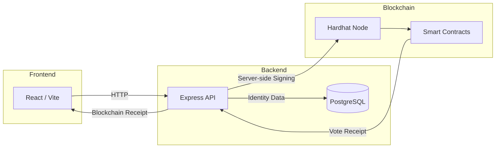

# Hi, I'm Nadjibou Mohamed Taybou 👋

---

Computing student and hands-on Technology professional based in Accra, Ghana. I build data pipelines, deploy ERP systems, and ship full-stack applications. Currently leading technical operations at a multi-branch retail business, managing a Dockerized ERPNext deployment and real-time Power BI analytics. Targeting roles in **Data Analytics**, **Data Engineering**, and **IT/Cybersecurity Operations**.

---

## 🛠️ Tech Stack

**Data & Analytics**

**ERP & Databases**

**DevOps & Infrastructure**

**Web & Full-Stack**

**Design**

---

## 🚀 Featured Projects

### 🔄 [Crypto Data Pipeline & Analytics](https://github.com/NadjibMoha/crypto-pipeline)
> *Apache Airflow · PostgreSQL · Python · Pandas · Docker · Streamlit*

Production-style end-to-end ETL pipeline that extracts real-time cryptocurrency data from CoinGecko and Binance, applies technical indicators, loads into a PostgreSQL data warehouse, and serves a live Streamlit dashboard — all orchestrated with Airflow and containerized with Docker Compose. Connects directly to Power BI and Looker Studio for BI reporting.

---

### 🤖 [DataScrub AI — AI-Powered Data Cleaning Agent](https://github.com/NadjibMoha/DataScrub-AI)
> *Python · Streamlit · Pandas · Google Gemini · OpenAI GPT-4o*

Agentic data cleaning tool that audits CSV datasets using LLMs, detects issues across 5 categories (type errors, format inconsistencies, outliers, duplicates, sentinel values), generates executable Pandas cleaning scripts, and presents a human-in-the-loop review flow before applying any changes. Supports both Gemini and OpenAI backends.

---

### 🗳️ [AcadeVote — Blockchain Academic Voting System](https://github.com/NadjibMoha/AcadeVote)
> *Solidity · Node.js · React · PostgreSQL · Hardhat · ethers.js · Docker*

Full-stack blockchain voting platform with three Solidity smart contracts (VoterRegistry, ElectionFactory, VotingContract). Uses a privacy-by-design model — identity data stays off-chain in PostgreSQL; only pseudonymous tokens are written to the Ethereum blockchain. Features three role-based access levels (Admin, Voter, Auditor) with fully automated Docker deployment.

---

### 🏪 [ERPNext Multi-Branch Deployment](https://github.com/NadjibMoha/erpnext-multi-branch)
> *Docker · Ubuntu · ERPNext · MariaDB*

Dockerized ERPNext deployment managing inventory and operations across 4+ retail branches, with automated FIFO/Moving Average inventory valuation, custom DocTypes, and Power BI integration for real-time dashboards. Running in production at Bizo Tech Trading Co.

---

### 📊 [Sales & Supply Chain BI Dashboard](https://github.com/NadjibMoha/sales-bi-dashboard)
> *Power BI · ERPNext API · Advanced Excel*

Multi-page Power BI dashboard connected live to ERPNext, tracking top-selling SKUs, branch performance, and regional sales trends. Reduced manual reporting from hours to near-real-time automated refresh.

---

### 🏷️ [Smart Barcode Label Generator](https://github.com/NadjibMoha/Barcode-Label-Generator)
> *Next.js · TypeScript · Tailwind CSS · jsPDF · JsBarcode*

Web app for generating, customizing, and bulk-exporting product labels with barcodes and QR codes. Supports CSV/JSON import, real-time preview, print-ready PDF export, and SVG batch ZIP download, with smart auto-fit logic for dynamic label sizing.

---

## 💼 Experience

**Technical Operations Lead** *(Sep 2025 – Present)*
- Deployed and manage a Dockerized ERPNext instance on Ubuntu Linux across 4+ branches
- Built real-time Power BI dashboards integrated with ERPNext for sales and supply chain analytics
- Automated inventory valuation and financial reporting; administer VPS and Linux environments

---

## 🎓 Education

**BSc (Hons) Computing** — IPMC College of Technology, Accra *(2023 – Present)*
**NCC Education Level 5 Diploma in Computing with Business Management** *(Awarded 2025)*

---

## 📬 Get in Touch

- 📧 [mohamednadjibou10@gmail.com](mailto:mohamednadjibou10@gmail.com)
- 💼 [LinkedIn](https://www.linkedin.com/in/nadjibou-mohamed-taybou-76616b313/)
- 🐙 [GitHub](https://github.com/NadjibMoha)
